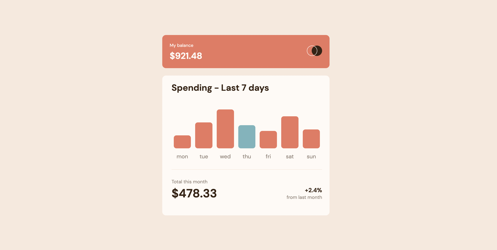

# Frontend Mentor - Expenses chart component solution

This is a solution to the [Expenses chart component challenge on Frontend Mentor](https://www.frontendmentor.io/challenges/expenses-chart-component-e7yJBUdjwt). Frontend Mentor challenges help you improve your coding skills by building realistic projects. 

## Table of contents

- [Overview](#overview)
  - [The challenge](#the-challenge)
  - [Screenshot](#screenshot)
  - [Links](#links)
- [My process](#my-process)
  - [Built with](#built-with)
  - [What I learned](#what-i-learned)
  - [Continued development](#continued-development)
  - [Useful resources](#useful-resources)
- [Author](#author)
- [Acknowledgments](#acknowledgments)

**Note: Delete this note and update the table of contents based on what sections you keep.**

## Overview

### The challenge

Users should be able to:

- View the bar chart and hover over the individual bars to see the correct amounts for each day
- See the current day’s bar highlighted in a different colour to the other bars
- View the optimal layout for the content depending on their device’s screen size
- See hover states for all interactive elements on the page
- **Bonus**: Use the JSON data file provided to dynamically size the bars on the chart

### Screenshot

### Links

- Solution URL: [https://github.com/TomRadford/fem-expenses-chart](https://github.com/TomRadford/fem-expenses-chart)
- Live Site URL: [https://heroic-blancmange-3c59c1.netlify.app/](https://heroic-blancmange-3c59c1.netlify.app/)

## My process

### Built with

- Semantic HTML5 markup
- CSS custom properties
- Flexbox
- CSS Grid
- Mobile-first workflow
- [React](https://reactjs.org/) - JS library
- [SASS](https://sass-lang.com/) - For styles

### What I learned

I got to implement SASS in a project for the first time while also learning some new CSS grid tricks.

### Continued development

I found the SASS workflow within a react project a little clunky - especially in terms of not being able to allow components to be self-contained if I had to break the project down into the atomic structure (their styling would exist in seperate SCSS's). In future, I want to tro use something like styled-components or tailwind for a more component-centric approach.

## Author

- Website - [Tom Radford](https://tomradford.co.za)

